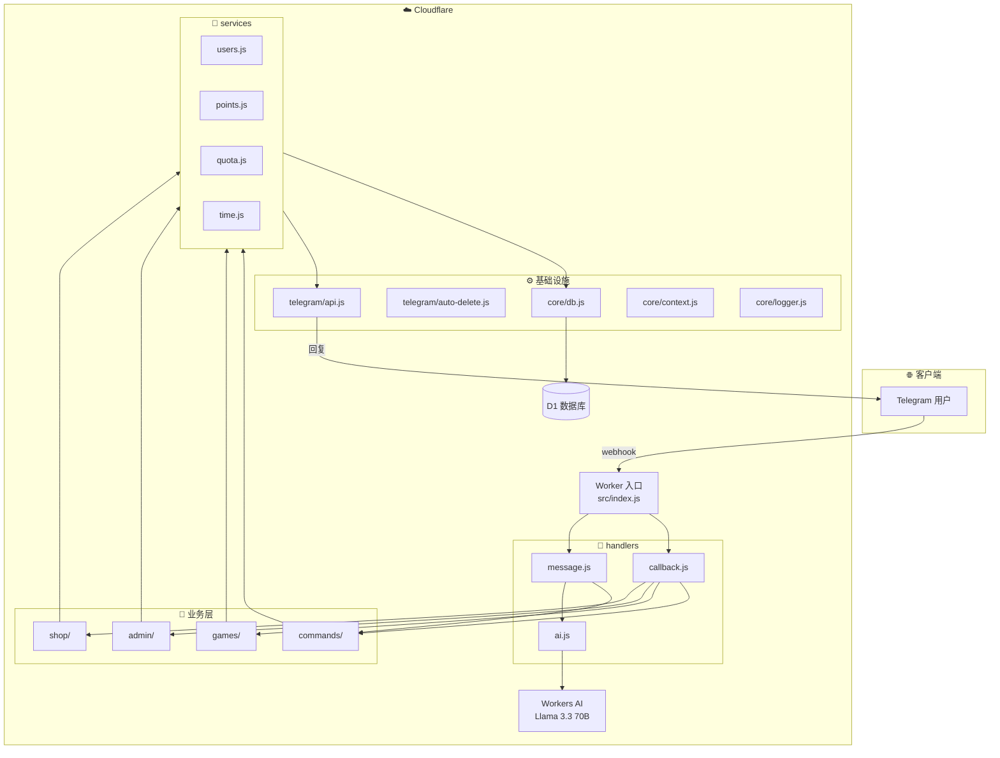
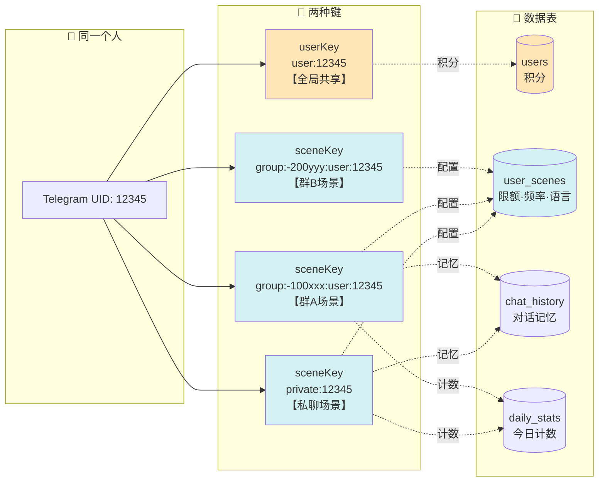
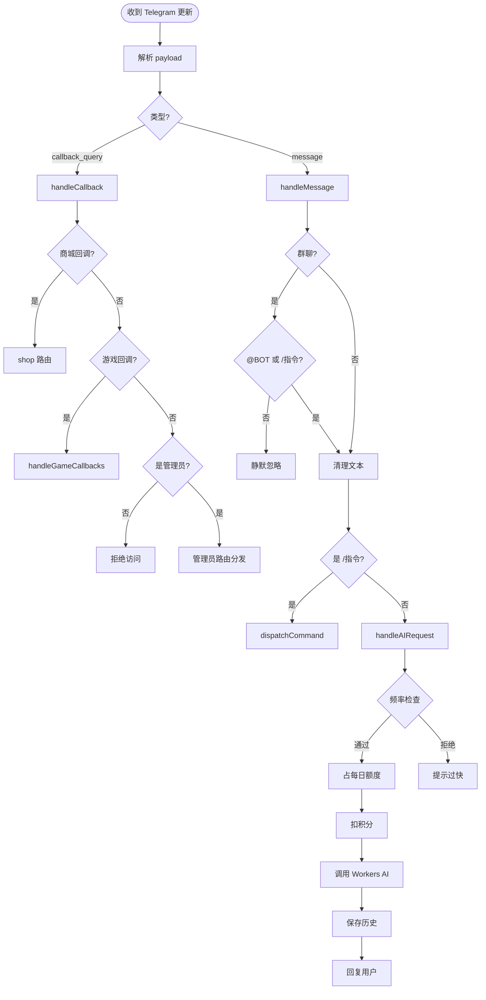
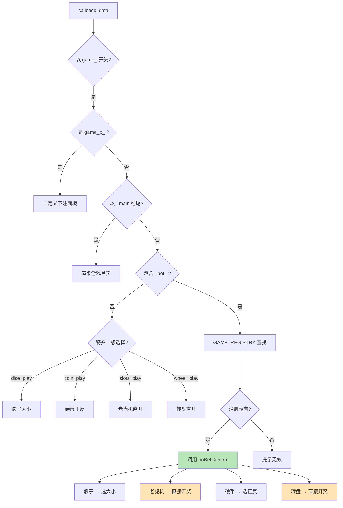
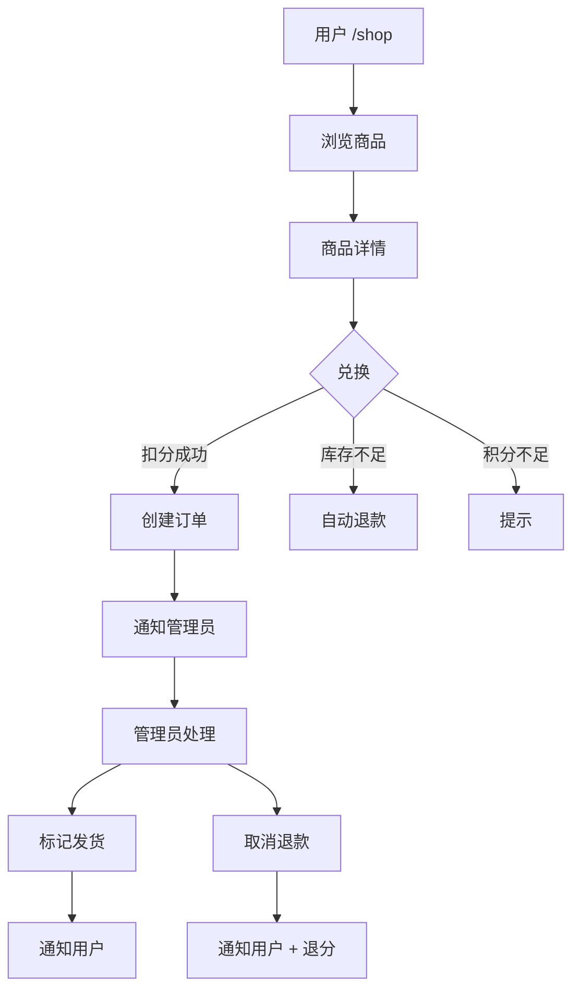
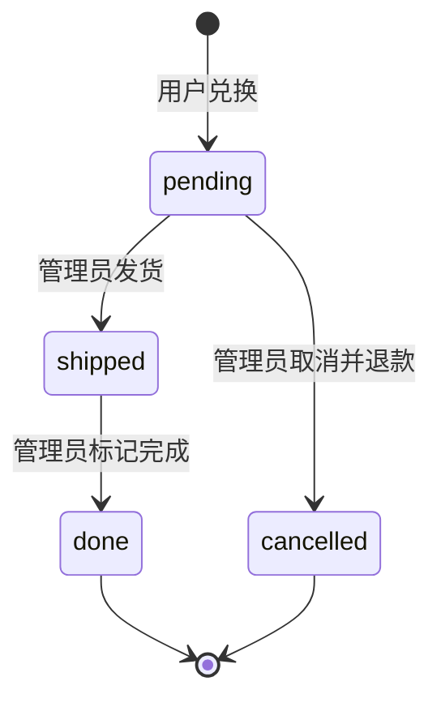
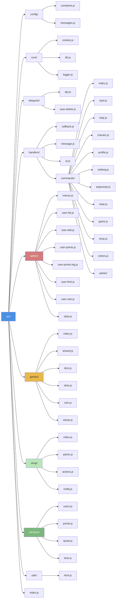

# 🤖 Telegram AI Bot (Cloudflare Workers)

一个基于 **Cloudflare Workers + D1 + Workers AI** 的 Telegram 机器人，支持 AI 对话、全局积分、每日签到、多人在线小游戏、积分商城，以及完整的后台管理控制台。

> 当前版本：v1.0.0（2026-09-11）

---

## 📑 目录

- [✨ 功能特性](#-功能特性)
- [📐 架构总览](#-架构总览)
- [🔑 用户标识与数据隔离](#-用户标识与数据隔离)
- [🔄 消息处理流程](#-消息处理流程)
- [🎮 游戏模块](#-游戏模块)
- [🛒 商城模块](#-商城模块)
- [📁 目录结构](#-目录结构)
- [🚀 部署步骤](#-部署步骤)
- [📖 指令列表](#-指令列表)
- [🔧 常见问题](#-常见问题)
- [🧩 扩展新游戏](#-扩展新游戏)
- [🛒 扩展商城](#-扩展商城)
- [🛠️ 常用命令](#️-常用命令)
- [⚖️ 合规说明](#️-合规说明)
- [🔐 安全说明](#-安全说明)

---

## 🚀 快速开始

### 1. 环境准备

- Node.js 18+（推荐 LTS）
- Cloudflare account
- Telegram Bot Token
- Cloudflare D1 数据库
- Cloudflare Workers AI（可选：AI 对话功能依赖）

### 2. 配置环境变量

在 Cloudflare Worker 环境变量中设置：

- `BOT_TOKEN`：Telegram Bot Token
- `BOT_USERNAME`：Bot 用户名（如 `@MyBot` 或 `MyBot`，推荐设置）
- `MY_TELEGRAM_ID`：管理员 Telegram 用户 ID
- `APP_TIMEZONE`：时区，默认 `Asia/Shanghai`
- `DB`：D1 数据库绑定
- `AI`：Workers AI 绑定

### 3. 初始化数据库

数据库表会在 Bot 第一次收到请求时**自动创建**（`src/core/db.js` 的 `ensureSchema` 会执行 `SCHEMA_SQL`，全部为 `CREATE TABLE IF NOT EXISTS`，幂等且不破坏已有数据）。

如需手动初始化，可执行 `SCHEMA_SQL`，包含以下表：

- `users`
- `user_scenes`
- `chat_history`
- `daily_stats`
- `daily_checkin`
- `points_log`
- `shop_items`
- `shop_orders`
- `shop_order_log`

### 4. 部署

1. 使用生产配置部署：`npx wrangler deploy -c wrangler.production.toml`
2. 确保 webhook 指向 Worker 入口
3. 设置 Telegram webhook：`https://api.telegram.org/bot<token>/setWebhook?url=<worker_url>`
4. 向 Bot 发送 `/start` 进行初始化

---

## ✨ 功能特性

### 🤖 AI 对话
- 基于 Cloudflare Workers AI 的 **Llama 3.3 70B** 模型
- 支持自定义 AI 偏好（`/setprompt`）
- 支持多语言偏好（`/setlang`）
- 每个对话场景独立保存记忆（私聊 / 每个群成员各自上下文）
- AI 调用失败或未绑定时自动退款

### 💰 积分系统
- **全局共享**：同一个人在私聊、群 A、群 B 的积分是**同一个**
- 每次 AI 对话扣 **1 分**，失败自动退款
- 每日签到 **+5 分**（北京时间每天一次）
- 管理员可任意增减用户积分
- 每笔变动写入 `points_log` 流水

### 📅 每日签到
- `/checkin` 或 `/sign`
- 按**北京时间**（`Asia/Shanghai`）计算日期
- 每天只能签一次，累计天数可查

### 🎮 游戏大厅
| 游戏 | 说明 | 赔率 |
|------|------|------|
| 🎲 骰子猜大小 | 猜 3 个骰子点数和的大小 | 1:2 |
| 🎰 欢乐老虎机 | 三个相同图标中奖 | 2x / 10x / 50x |
| 🪙 抛硬币 | 猜正反面 | 1:2 |
| 🎡 幸运转盘 | 转盘抽随机倍率 | 0x ~ 50x |

- 支持**自定义下注**
- 支持 **ALL IN（全押）**
- 所有游戏共享同一份积分池

### 🛒 积分商城
- **仅私聊可用**，群聊里禁用
- 用户用积分兑换**虚拟/实物/服务类**商品
- 管理员可上下架商品、处理订单
- 下单自动扣积分，取消自动退款
- 每笔积分变动写入流水
- 支持**库存管理**（无限库存 / 有限库存）
- **新订单自动通知管理员**

### 👑 管理控制台
- `/admin` 打开控制台
- 私聊场景 / 群聊场景**分开管理**
- 用户积分、每日限额、发送频率独立配置
- 积分流水完整记录
- 系统运行状态与统计

### 🗑️ 群聊智能回复
- 群里只有 **@BOT** 或 **/指令** 才回复
- 指令类消息（`/start`、`/help` 等）**5 秒后自动删除**
- AI 回复、游戏消息、管理员菜单**保留**

---

## 📐 架构总览

### 分层图（Mermaid）



### 简化 ASCII 图

```
┌─────────────────────────────────────────────┐
│           Telegram Bot (Worker)             │
├─────────────────────────────────────────────┤
│  handlers/   →  callback / message / ai     │
│       ↓                                     │
│  commands/ · games/ · admin/ · shop/        │
│       ↓                                     │
│  services/   →  users / points / quota/time │
│       ↓                                     │
│  core/ + telegram/                          │
│       ↓                                     │
│  D1 Database + Workers AI                   │
└─────────────────────────────────────────────┘
```

---

## 🔑 用户标识与数据隔离

项目使用**两套键**区分「积分」与「场景配置」：

| 键 | 格式 | 用途 |
|----|------|------|
| `userKey` | `user:<uid>` | 积分、积分流水（**全局共享**） |
| `sceneKey` | `private:<uid>` 或 `group:<cid>:user:<uid>` | 限额、频率、历史、语言（**按场景隔离**） |

**效果**：同一个人在不同群里 AI 记忆互相独立，但积分是同一份。



---

## 🔄 消息处理流程



---

## 🎮 游戏模块

### 通用分发机制

游戏采用**注册表 + 通用路由**，新增游戏只需改 3 处，不需要碰任何路由判断。



### 现有游戏

| 图标 | 名称 | 二级选择 | 赔率 |
|------|------|---------|------|
| 🎲 | 骰子猜大小 | 有（选大/小） | 1:2 |
| 🎰 | 欢乐老虎机 | 无（直接开奖） | 2x / 10x / 50x |
| 🪙 | 抛硬币 | 有（正/反） | 1:2 |
| 🎡 | 幸运转盘 | 无（直接开奖） | 0x ~ 50x |

---

## 🛒 商城模块

### 用户侧流程



### 订单状态机



### 数据库表

| 表 | 用途 |
|----|------|
| `shop_items` | 商品（名称、图标、价格、库存、分类、上下架状态） |
| `shop_orders` | 订单（订单号、用户、商品快照、价格快照、状态） |
| `shop_order_log` | 订单操作日志（发货、取消等） |

### 关键设计

- **商品快照**：订单保存 `item_name`、`item_icon`、`price`，即使商品被改名/删除，历史订单也能正确显示
- **原子扣分**：`tryDeductPoints` 用 `UPDATE ... WHERE points >= ?` 保证并发安全
- **库存不足自动退款**：扣库存失败时立即退还积分
- **取消自动退库存 + 退积分**：事务化处理
- **通知管理员**：优先 `ADMIN_NOTIFY_CHAT_ID`，兜底 `MY_TELEGRAM_ID`

---

## 📁 目录结构



### 完整目录树（文字版）

```
tgbot/
├── wrangler.toml                    # Cloudflare Workers 配置（GitHub 模板）
├── wrangler.production.toml         # 生产配置（本地，勿提交）
├── README.md                        # 项目说明
├── CHANGELOG.md                     # 版本历史
│
└── src/
    ├── index.js                     # 🚀 Worker 入口
    │
    ├── config/                      # ⚙️ 配置层
    │   ├── constants.js             # 全局常量（含商城常量）
    │   └── messages.js              # 用户可见文案
    │
    ├── core/                        # 🧱 核心基础
    │   ├── context.js               # 用户上下文构建（userKey / sceneKey）
    │   ├── db.js                    # 数据库 Schema（含商城表）
    │   └── logger.js                # 日志封装
    │
    ├── telegram/                    # 📡 Telegram 交互层
    │   ├── api.js                   # Bot API 封装
    │   └── auto-delete.js           # 群聊指令类消息 5 秒自动删除
    │
    ├── handlers/                    # 🎯 处理器
    │   ├── callback.js              # callback_query 总入口
    │   ├── message.js               # 普通消息总入口
    │   ├── ai.js                    # AI 对话流程
    │   └── commands/                # 📖 指令实现
    │       ├── index.js             # 指令注册表
    │       ├── start.js
    │       ├── help.js
    │       ├── checkin.js
    │       ├── profile.js
    │       ├── setlang.js
    │       ├── setprompt.js
    │       ├── clear.js
    │       ├── game.js
    │       ├── shop.js              # /shop 入口
    │       ├── orders.js            # /orders 入口
    │       └── admin/
    │           └── index.js         # /admin /users /users_group /stats /addpoints
    │
    ├── admin/                       # 👑 管理面板 UI
    │   ├── menus.js                 # 主菜单（支持 showShop 参数）
    │   ├── user-list.js             # 用户列表（私聊/群聊）
    │   ├── user-edit.js             # 场景编辑 + 删除
    │   ├── user-points.js           # 积分增减
    │   ├── user-points-log.js       # 积分流水
    │   ├── user-limit.js            # 每日限额
    │   ├── user-rate.js             # 发送频率
    │   └── stats.js                 # 系统统计
    │
    ├── games/                       # 🎮 游戏模块
    │   ├── index.js                 # 注册表 + 分发器
    │   ├── shared.js                # 自定义下注面板
    │   ├── dice.js                  # 🎲 骰子猜大小
    │   ├── slots.js                 # 🎰 欢乐老虎机
    │   ├── coin.js                  # 🪙 抛硬币
    │   └── wheel.js                 # 🎡 幸运转盘
    │
    ├── shop/                        # 🛒 积分商城
    │   ├── index.js                 # 用户侧：首页 / 详情 / 兑换 / 我的订单
    │   ├── admin.js                 # 管理员侧：商品/订单管理 UI
    │   ├── actions.js               # 管理员操作：上下架/删除/发货/取消
    │   └── notify.js                # 通知管理员
    │
    ├── services/                    # 🔧 业务服务层
    │   ├── users.js                 # 用户/场景 upsert、配置读写
    │   ├── points.js                # 积分加减、退款、流水
    │   ├── quota.js                 # 每日额度预留、退款
    │   └── time.js                  # 时区、日期键
    │
    └── utils/                       # 🔨 工具
        └── html.js                  # HTML 转义
```

---

## 🚀 部署步骤

### 前置要求
- Windows / macOS / Linux
- Node.js 18+ 与 npm
- Cloudflare 账号（免费版即可）

### 1. 安装 Node.js

从 https://nodejs.org/ 下载 LTS 版本并安装。

验证：

```bash
node -v
npm -v
```

### 2. 安装 Wrangler

```bash
npm install -g wrangler
```

### 3. 登录 Cloudflare

```bash
wrangler login
```

### 4. 创建项目

```bash
mkdir tgbot
cd tgbot
```

### 5. 准备配置文件

项目拆分为两个配置文件：

| 文件 | 用途 | 是否提交 GitHub |
|------|------|----------------|
| `wrangler.toml` | GitHub 模板，只含占位符，不含真实密钥 | ✅ 提交 |
| `wrangler.production.toml` | 生产配置，含真实 Token / ID / D1 database_id | ❌ 已加入 `.gitignore` |

`wrangler.production.toml` 示例：

```toml
name = "tgbot"
main = "src/index.js"
compatibility_date = "2025-01-01"

[vars]
BOT_TOKEN = "你的机器人Token"
BOT_USERNAME = "Zooolp_bot"
MY_TELEGRAM_ID = "你的Telegram数字ID"
APP_TIMEZONE = "Asia/Shanghai"
BOT_OWNER_NAME = "管理员"
BOT_OWNER_USERNAME = "Zooolp_admin"

[[d1_databases]]
binding = "DB"
database_name = "tgbot-db"
database_id = "你的D1数据库ID"

[ai]
binding = "AI"
```

### 6. 创建 D1 数据库

```bash
wrangler d1 create tgbot-db
```

把输出的 `database_id` 填到 `wrangler.production.toml`。

### 7. 初始化数据库表

部署后第一次收到 Bot 消息时，Worker 会自动调用 `ensureSchema` 建表，无需手动执行。

（可选）如需手动执行，可把 `src/core/db.js` 里的 `SCHEMA_SQL` 复制到 Cloudflare Dashboard → D1 → Console 执行；所有语句都是 `CREATE TABLE IF NOT EXISTS`，可以**重复执行**。

### 8. 配置环境变量

生产环境变量写在 `wrangler.production.toml` 的 `[vars]` 中：

| 变量名 | 说明 | 必填 |
|--------|------|------|
| `BOT_TOKEN` | Telegram Bot Token | ✅ |
| `MY_TELEGRAM_ID` | 管理员 Telegram 数字 ID | ✅ |
| `BOT_USERNAME` | 机器人用户名（不含 @） | 建议 |
| `APP_TIMEZONE` | 时区（默认 `Asia/Shanghai`） | 可选 |
| `BOT_OWNER_NAME` | 管理员显示名称 | 可选 |
| `BOT_OWNER_USERNAME` | 管理员用户名 | 可选 |

> 若更看重安全性，可把 `BOT_TOKEN` 改为 Worker Secret，而不是写入 `[vars]`。

### 9. 部署

```bash
wrangler deploy -c wrangler.production.toml
```

### 10. 绑定 Webhook

访问：

```
https://api.telegram.org/bot<你的BOT_TOKEN>/setWebhook?url=<你的Worker URL>
```

返回 `{"ok":true,...}` 即成功。

### 11. 关闭群聊 Privacy Mode（重要）

去 **@BotFather**：

1. `/mybots` → 选择你的 bot
2. **Bot Settings** → **Group Privacy** → **Turn off**
3. 把 bot 从所有群里移除再重新添加

### 12. 添加测试商品

在 D1 Console 执行：

```sql
INSERT INTO shop_items (name, description, icon, price, stock, category, enabled) VALUES
  ('专属称号', '在群内显示专属称号', '🏷️', 50, -1, 'virtual', 1),
  ('AI 加速包 (10 次)', '免消耗 10 次 AI 对话额度', '⚡', 100, -1, 'service', 1),
  ('定制表情包', '管理员为你制作 1 个专属表情', '🎨', 200, 5, 'virtual', 1);
```

---

## 📖 指令列表

### 普通用户

| 指令 | 说明 |
|------|------|
| `/start` | 开始使用 |
| `/help` | 查看指令列表 |
| `/checkin` 或 `/sign` | 每日签到（+5 积分） |
| `/game` | 打开游戏大厅 |
| `/profile` | 查看个人信息卡片 |
| `/setlang <zh/en>` | 切换语言 |
| `/setprompt <设定>` | 设置 AI 偏好 |
| `/clear` | 清空对话历史 |
| `/shop` | 打开积分商城（仅私聊） |
| `/orders` | 查看我的订单（仅私聊） |

### 管理员

| 指令 | 说明 |
|------|------|
| `/admin` | 打开管理控制台 |
| `/users` | 私聊用户管理 |
| `/users_group` | 群聊用户管理 |
| `/stats` | 系统统计 |
| `/addpoints <场景ID> <数量>` | 调整用户积分 |
| `/shop_admin` | 打开商城管理（仅私聊，需先 /admin） |

> 管理员指令需先输入 `/admin` 解锁，30 分钟内有效。

---

## 🔧 常见问题

### Q1: 部署时报 "Could not resolve xxx.js"
**原因**：`import` 的路径对应的文件不存在。
**解决**：检查文件是否创建，路径是否正确（注意大小写）。

### Q2: 部署时报 "The symbol xxx has already been declared"
**原因**：某个文件的代码被**粘贴了两遍**。
**解决**：打开对应文件，删除重复部分。用 `Ctrl+Shift+F` 搜索 `import {` 检查。

### Q3: 部署时报 "Expected '}' but found '...'"
**原因**：某个对象/数组**漏了逗号**，或括号未闭合。
**解决**：检查报错行附近。常见的是 `COMMANDS` 对象最后一项后面漏逗号。

### Q4: 点按钮没反应
**排查**：
1. Dashboard → Worker → Logs（实时日志）
2. 看有没有 `handleGameCallbacks 异常` 或 `callback 未匹配`
3. 检查 `callback_data` 前缀与路由是否一致

### Q5: 群里不回复
1. 确认已关闭 Privacy Mode
2. 确认 `BOT_USERNAME` 环境变量填对
3. 确认消息里确实有 `@bot` 或 `/`

### Q6: 积分不同步
检查是不是用了旧的单文件版本。新架构中积分基于 `userKey`（`user:<uid>`），跨私聊/群聊共享。

### Q7: 签到日期不对
- 默认 `Asia/Shanghai`（北京时间）
- 若需要其他时区，设置环境变量 `APP_TIMEZONE=Asia/Tokyo` 等

### Q8: 管理员收不到商城订单通知
1. 确认管理员**已经跟 Bot 私聊过**（发过 `/start`）
2. 确认 `MY_TELEGRAM_ID` 或 `ADMIN_NOTIFY_CHAT_ID` 填对
3. 看 Cloudflare 日志有没有 `通知管理员失败`

### Q9: 群聊里点商城按钮弹「仅支持私聊」
这是**预期行为**。商城只支持私聊。群里点任何商城按钮都会被拒绝。

### Q10: 兑换后积分没扣
检查 `points_log` 表有没有记录。如果没记录，说明 `handleShopBuy` 里的 `tryDeductPoints` 出错了。

---

## 🧩 扩展新游戏

在 `src/games/` 目录下创建一个新文件（如 `lucky.js`）：

```js
// src/games/lucky.js
import { editMessageText, answerCallback } from "../telegram/api.js";
import { getUserPoints } from "../services/users.js";
import { logPointChange, tryDeductPoints, adjustPoints } from "../services/points.js";

export const LuckyGame = {
  async renderMain(token, env, chatId, userKey, messageId) {
    // 渲染首页（选金额）
  },
  async play(token, env, callbackId, chatId, userKey, messageId, betAmount) {
    // 开奖逻辑
  }
};
```

然后在 `src/games/index.js` 里：

1. `import { LuckyGame } from "./lucky.js";`
2. 在 `GAME_REGISTRY` 加一项：

```js
lucky: {
  renderMain: (t, e, c, u, m) => LuckyGame.renderMain(t, e, c, u, m),
  onBetConfirm: (t, e, cbId, c, u, m, amt) => LuckyGame.play(t, e, cbId, c, u, m, amt)
}
```

3. 在 `renderGameCenter` 里加一个按钮：

```js
[{ text: "🍀 幸运游戏", callback_data: "game_lucky_main" }]
```

**完成**！通用路由会自动处理 `game_lucky_main` / `game_lucky_bet_N` / `game_lucky_play_N`。

---

## 🛒 扩展商城

### 添加商品

**方式 1**：D1 Console 直接 INSERT（推荐，简单）

```sql
INSERT INTO shop_items (name, description, icon, price, stock, category, enabled)
VALUES ('新商品名', '商品说明', '🎁', 100, -1, 'virtual', 1);
```

**方式 2**：后续可加「对话式添加商品」功能（管理员在私聊里逐步输入商品信息）

### 添加新订单动作

在 `src/shop/actions.js` 里加一个函数，比如「退款但保留订单」：

```js
export async function actionRefundOnly(token, env, callback, orderId) {
  const o = await env.DB.prepare("SELECT * FROM shop_orders WHERE id = ?").bind(orderId).first();
  if (!o || o.status === "cancelled") return answerCallback(token, callback.id, "❌ 无法操作", true);

  await refundPoint(env, o.user_key, o.price, `订单 ${o.order_no} 单独退款`);

  await env.DB.prepare(
    "INSERT INTO shop_order_log (order_id, action, note) VALUES (?, 'refunded_only', 'admin')"
  ).bind(orderId).run();

  await answerCallback(token, callback.id, "✅ 已退款");
}
```

然后在 `src/shop/admin.js` 的订单详情里加按钮，在 `src/handlers/callback.js` 加路由 `shop_admin_refund_`。

### 增加商品分类

修改 `shop_items.category` 字段的取值，比如加 `coupon`（优惠券）、`subscription`（订阅）。前端展示时按分类过滤。

---

## 🛠️ 常用命令

```bash
# 部署到生产环境（使用本地生产配置）
wrangler deploy -c wrangler.production.toml

# 本地预览
wrangler dev

# 查看实时日志
wrangler tail

# 操作数据库
wrangler d1 execute tgbot-db --remote --command "SELECT * FROM users LIMIT 10;"

# 导出数据
wrangler d1 export tgbot-db --output=backup.sql --remote

# 查看 Worker 版本
wrangler versions list
```

---

## 📁 目录速查

| 路径 | 说明 |
|------|------|
| `src/index.js` | Worker 入口 |
| `src/config/` | 常量与文案 |
| `src/core/` | 上下文、DB Schema、日志 |
| `src/telegram/` | Bot API 与自动删除 |
| `src/handlers/` | 消息/回调分发 |
| `src/handlers/commands/` | 各指令实现 |
| `src/handlers/commands/admin/` | 管理员指令 |
| `src/admin/` | 管理面板 UI |
| `src/games/` | 游戏模块 |
| `src/shop/` | 商城模块 |
| `src/services/` | 业务服务层 |
| `src/utils/` | 工具函数 |

---

## ⚖️ 合规说明

本项目**积分设计仅用于社区互动**，遵守以下原则：

- ❌ 不与法币双向兑换（积分不可提现）
- ❌ 不承诺积分升值或投资收益
- ❌ 不涉及二级市场交易
- ❌ 不承诺"持有分红"、"平台回购"
- ✅ 积分仅可兑换平台内商品/服务
- ✅ 每笔交易有完整流水记录
- ✅ 管理员可随时查看、冻结异常账户

**若未来引入商户通兑或链上存证，需另行评估合规性。** 特别是：

- 商户联盟的**跨商户通兑**需要真实的商户合作
- **链上存证**只用于记录透明，不应承诺任何投资收益
- 积分**不可反向兑换为法币**

---

## 🔐 安全说明

- **BOT_TOKEN** 仅存放在本地的 `wrangler.production.toml`，已通过 `.gitignore` 排除，不写入代码或 GitHub
- **MY_TELEGRAM_ID** 用于管理员权限校验，非管理员无法访问 `/admin`
- **管理员会话 30 分钟自动过期**，需重新 `/admin` 解锁
- **积分变动全部有日志**（`points_log`）
- **订单状态变更全部有日志**（`shop_order_log`）
- **商城仅私聊可用**，防止群聊刷单
- **原子扣分**：用 SQL `UPDATE ... WHERE points >= ?` 防止并发超扣
- **库存不足自动退款**：扣库存失败时立即退还积分

---

## 📝 许可

MIT License

---

## 💡 致谢

- [Cloudflare Workers](https://workers.cloudflare.com/)
- [Cloudflare D1](https://developers.cloudflare.com/d1/)
- [Cloudflare Workers AI](https://developers.cloudflare.com/workers-ai/)
- [Telegram Bot API](https://core.telegram.org/bots/api)
