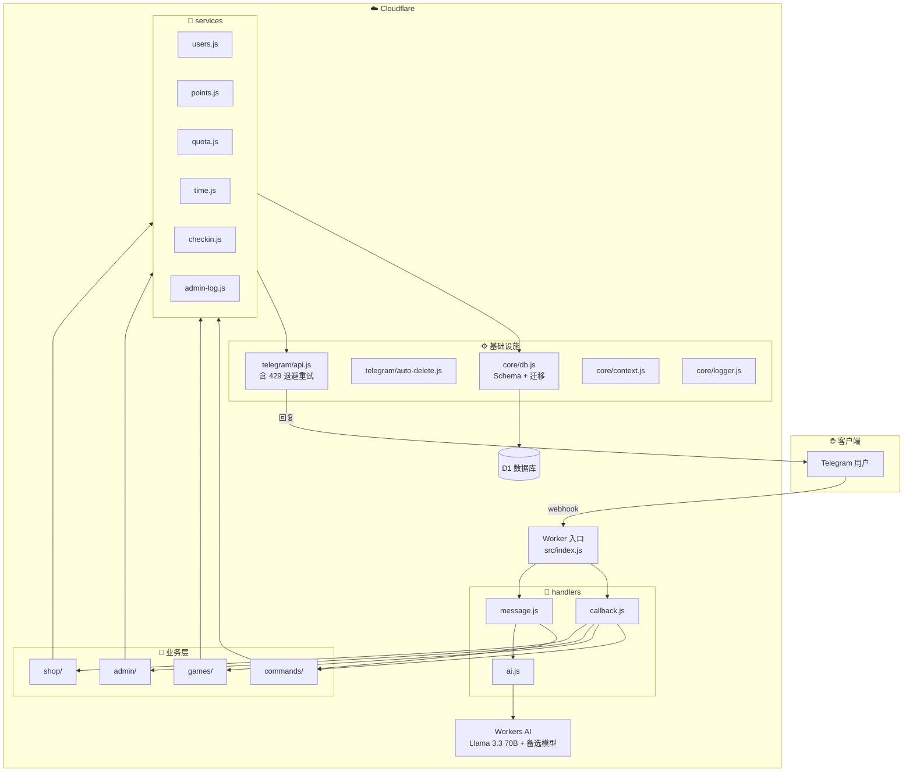
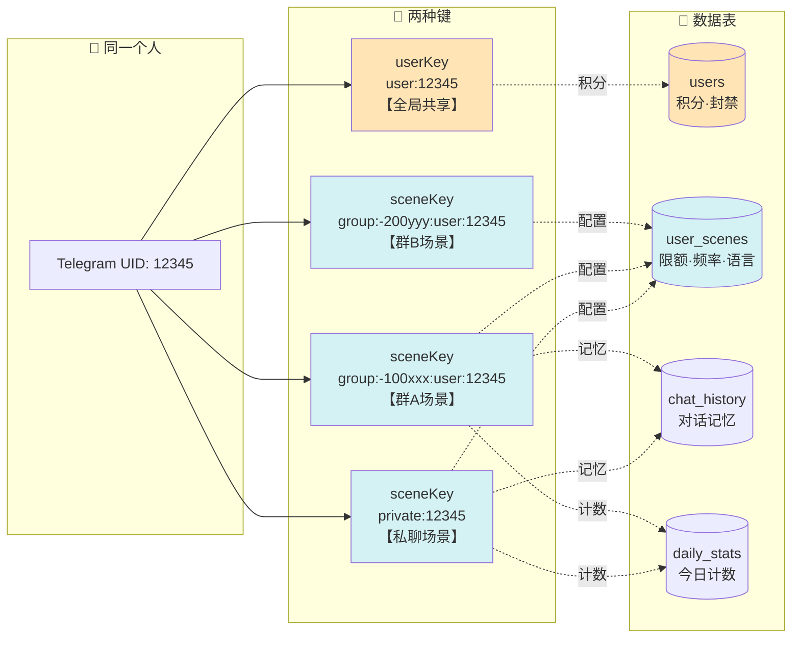
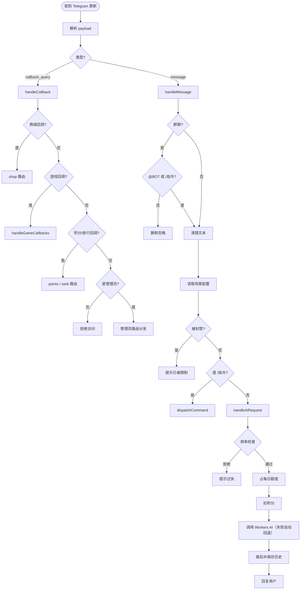
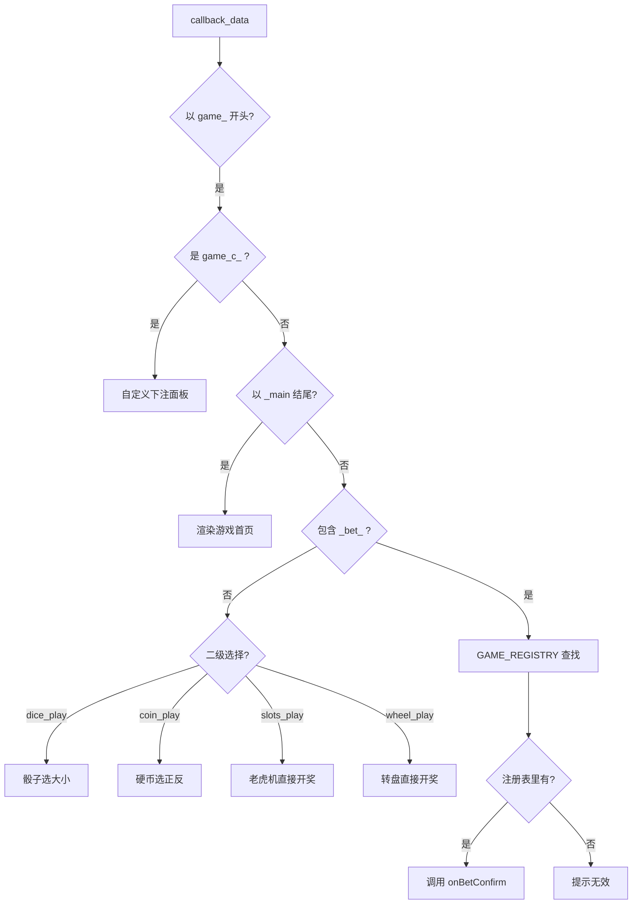
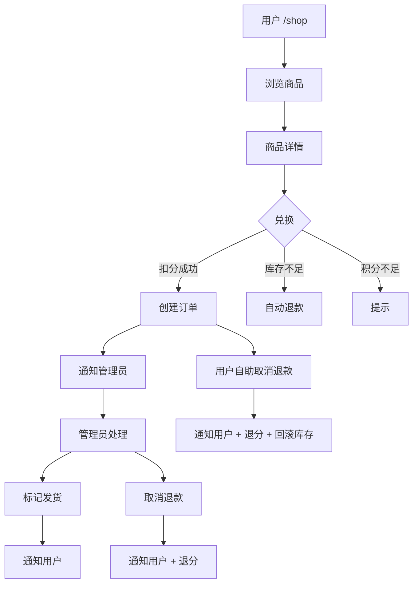
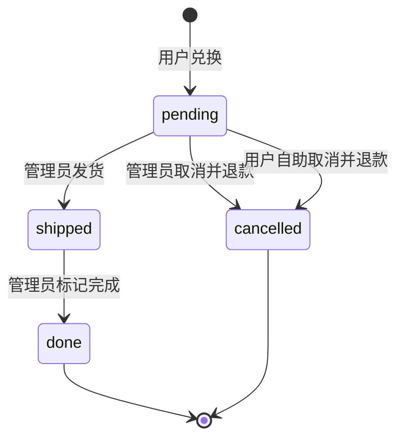
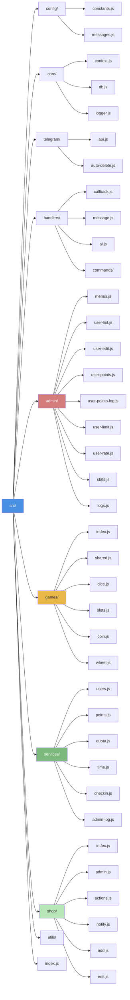

# 🤖 Telegram AI Bot (Cloudflare Workers)

一个跑在 **Cloudflare Workers + D1 + Workers AI** 上的 Telegram 机器人：AI 对话、全局积分、连续签到、小游戏、积分商城，外加一套完整的管理后台与审计日志。

> 当前版本：**v1.2.0**（2026-09-12） · 变更见 [CHANGELOG.md](CHANGELOG.md)

---

## 📑 目录

- [🌍 这个仓库是什么](#-这个仓库是什么)
- [✨ 功能特性](#-功能特性)
- [🚀 快速开始](#-快速开始)
- [⚙️ 配置项一览](#️-配置项一览)
- [📖 指令列表](#-指令列表)
- [🏗️ 架构总览](#️-架构总览)
- [🔑 用户标识与数据隔离](#-用户标识与数据隔离)
- [🔄 消息处理流程](#-消息处理流程)
- [🎮 游戏模块](#-游戏模块)
- [🛒 商城模块](#-商城模块)
- [👑 管理后台](#-管理后台)
- [📁 目录结构](#-目录结构)
- [🗄️ 数据库表](#️-数据库表)
- [🛠️ 运维命令](#️-运维命令)
- [💾 备份与恢复](#-备份与恢复)
- [🔐 安全说明](#-安全说明)
- [⚖️ 合规说明](#️-合规说明)
- [🔧 常见问题](#-常见问题)
- [🧩 扩展指南](#-扩展指南)
- [📝 许可](#-许可)

---

## 🌍 这个仓库是什么

**一个仓库，两个用途**：它既是开源项目，也是代码备份。本地写完代码 `git push`，开源发布与备份一次完成。

部署**在本地执行**，不依赖 GitHub Actions：

```bash
npm run deploy:prod    # 部署到 Cloudflare Workers（读取本地生产配置）
npm run dev            # 本地开发预览（读取 .dev.vars）
npm run check          # 提交前自检：语法 + import 路径
```

含密钥的文件**永远不进仓库**，各自有明确边界：

| 文件 | 内容 | 是否提交 |
|------|------|---------|
| `wrangler.toml` | 模板配置，全部是占位符 | ✅ 提交（公开） |
| `wrangler.production.toml` | 生产配置：Bot Token、账号 ID、D1 database_id | ❌ 本地（已 gitignore） |
| `.dev.vars` | `npm run dev` 用的环境变量 | ❌ 本地（已 gitignore） |
| `.config-backup` | 配置备份的目标私有仓库 `owner/repo` | ❌ 本地（已 gitignore） |

所以 GitHub 上只有代码。**那份含 Bot Token 的配置需要单独备份**，否则换电脑时要重新向 BotFather 取 Token：

```bash
npm run backup:config
```

它会把 `wrangler.production.toml` + `.dev.vars` 通过 GitHub API 推送到**私有**仓库（用 API 而非 git 协议，`github.com:443` 被墙时也能用），并且**上传前会先确认目标仓库是私有的**，不是私有就直接中止。

---

## ✨ 功能特性

### 🤖 AI 对话

- 默认模型 `@cf/meta/llama-3.3-70b-instruct-fp8-fast`（Workers AI）
- **自动回退**：主模型报错或返回空内容时，按 `llama-3.1-8b-instruct-fast → mistral-7b-instruct-v0.1` 依次重试，全部失败才提示「AI 服务异常」
- **上下文双重限制**：最多 10 条 + 最多 6000 字符（超出从最旧的消息丢弃，单条消息截断到 2000 字符）
- 每个场景独立记忆：私聊一份、每个群的每个成员各一份
- 可自定义 AI 偏好（`/setprompt`）与语言（`/setlang`）
- 调用失败 / AI 未绑定时**自动退还积分与每日额度**

### 💰 积分与排行榜

- **全局共享**：同一个人无论在私聊还是群 A、群 B，用的都是同一份积分
- 每次 AI 对话扣 **1 分**，失败自动退款
- 每笔变动写入 `points_log` 流水，`/points` 可分页查看
- `/rank` 查看积分排行榜 Top 10（含自己的名次与奖牌）
- 管理员可任意增减、封禁用户

### 📅 连续签到

- `/checkin`（或 `/sign`），按 `APP_TIMEZONE`（默认北京时间）判定日期，每天一次
- 奖励随连续天数递增：`min(5 + (连续天数 - 1), 20)`
- 每连续满 **7 天**额外 +20
- 断签后从第 1 天重新计算；签到卡片会同时显示累计天数、连续天数与明天的预计奖励

### 🎮 游戏大厅

| 游戏 | 玩法 | 赔率 |
|------|------|------|
| 🎲 骰子猜大小 | 3 个骰子点数和 3-10 为小、11-18 为大 | 1:2 |
| 🎰 欢乐老虎机 | 两个相同 2 倍 / 三个相同 10 倍 / 三个 💎 50 倍 | 2x · 10x · 50x |
| 🪙 抛硬币 | 猜正反面 | 1:2 |
| 🎡 幸运转盘 | 转盘抽倍率（30% 归零 ~ 0.5% 五十倍） | 0x ~ 50x |

- 支持自定义下注金额与 **ALL IN**
- 所有游戏共用同一份积分池，随机数用 `crypto.getRandomValues`（拒绝采样，无取模偏差）

### 🛒 积分商城

**仅私聊可用**（群聊里点任何商城按钮都会被拒绝）。

- 用户：浏览商品 → 兑换（自动扣分、扣库存、生成订单）→ 在我的订单里查看进度
- 用户可对**待处理订单自助取消并退款**（积分与库存同时回滚）
- 管理员：引导式添加商品 `/shop_add`、引导式编辑商品 `/shop_edit <商品ID>`
- 管理员：上架/下架、删除、标记发货、标记完成、取消并退款
- 商品支持无限库存（`-1`）与有限库存；订单保存商品快照，改价改名不影响历史订单
- 新订单自动通知管理员；用户自助取消也会通知管理员

### 👑 管理后台

- `/admin` 解锁（30 分钟有效），私聊场景与群聊场景分开管理
- 每个场景可单独设置每日额度与发送频率；积分是全局的
- **封禁 / 解封**：被封禁用户在 AI、游戏、商城、按钮回调上全部被拦截
- **群发消息** `/broadcast <内容>`：二次确认后分批推送，支持断点续发
- **操作审计** `/admin → 📋 操作日志`：谁在什么时候改了什么，可翻页
- **记忆管理** `/clearmem`：可精确清除「某群 + 某用户」的 AI 记忆

### 💬 群聊行为

- 群里只有 **@机器人** 或 **/指令** 才会响应，其他消息静默忽略
- 指令类消息默认 **5 秒后自动删除**（`/points`、`/rank` 等带按钮的卡片会保留，否则按钮会失效）
- AI 回复、游戏消息、管理员菜单保留
- 自动忽略发给其他机器人的指令（`/start@OtherBot`）

---

## 🚀 快速开始

### 0. 前置条件

| 需要什么 | 说明 |
|---------|------|
| Node.js | 18 以上（推荐 LTS） |
| Cloudflare 账号 | 免费版即可，需要 Workers + D1 |
| Telegram Bot Token | 找 [@BotFather](https://t.me/BotFather) 申请 |
| 管理员 Telegram ID | 可用 [@userinfobot](https://t.me/userinfobot) 查询 |

### 1. 克隆并安装

```bash
git clone https://github.com/<你的账号>/tgbot.git
cd tgbot
npm install
```

### 2. 创建 D1 数据库

```bash
npx wrangler login      # 首次需要登录
npx wrangler d1 create tgbot-db
```

命令会输出 `database_id`，下一步要用。

### 3. 写生产配置

复制 `wrangler.toml` 为 `wrangler.production.toml`，填入真实值：

```toml
name = "tgbot"
main = "src/index.js"
compatibility_date = "2025-01-01"

[vars]
BOT_TOKEN = "你的机器人Token"
BOT_USERNAME = "你的机器人用户名（不含 @）"
MY_TELEGRAM_ID = "你的管理员 Telegram 数字 ID"
WEBHOOK_SECRET = ""            # 可选，填了就要在 setWebhook 时传一样的值
APP_TIMEZONE = "Asia/Shanghai"
BOT_OWNER_NAME = "管理员"
BOT_OWNER_USERNAME = "你的管理员用户名（不含 @）"

[[d1_databases]]
binding = "DB"
database_name = "tgbot-db"
database_id = "上一步输出的 database_id"

[ai]
binding = "AI"
```

> `wrangler.production.toml` 已在 `.gitignore` 里，不会被提交。
> 记得到 `npm run backup:config` 备份它（见 [💾 备份与恢复](#-备份与恢复)）。

### 4. 部署

```bash
npm run deploy:prod
```

成功后终端会输出 Worker 地址，形如 `https://tgbot.<你的子域>.workers.dev`。

### 5. 绑定 Telegram Webhook

浏览器打开（把两处占位符替换掉）：

```
https://api.telegram.org/bot<你的BOT_TOKEN>/setWebhook?url=<你的Worker地址>
```

返回 `{"ok":true,...}` 即成功。想加一层校验可以带上 `&secret_token=<WEBHOOK_SECRET>`。

**数据库表不用手动建**：Worker 第一次收到请求时 `ensureSchema()` 会自动建表并执行增量迁移（幂等，不破坏已有数据）。

### 6. 关闭群聊 Privacy Mode（必须）

去 **@BotFather**：`/mybots` → 选择你的 bot → **Bot Settings** → **Group Privacy** → **Turn off**。
改完把 bot 从所有群移除再重新添加，否则群里 @ 它不回复。

### 7. 本地开发（可选）

```bash
# 手动创建 .dev.vars（已 gitignore），内容与 wrangler.production.toml 的 [vars] 一致
# 每个变量一行，形如 KEY="value"，然后：
npm run dev
```

`npm run backup:config` 会把 `.dev.vars` 一起备份。

### 8. 添加测试商品（可选）

在 D1 控制台执行：

```sql
INSERT INTO shop_items (name, description, icon, price, stock, category, enabled) VALUES
  ('专属称号', '在群内显示专属称号', '🏷️', 50, -1, 'virtual', 1),
  ('AI 加速包 (10 次)', '免消耗 10 次 AI 对话额度', '⚡', 100, -1, 'service', 1),
  ('定制表情包', '管理员为你制作 1 个专属表情', '🎨', 200, 5, 'virtual', 1);
```

也可以在私聊里用 `/shop_add` 走引导式添加。

---

## ⚙️ 配置项一览

### 环境变量

| 变量 | 必填 | 默认值 | 说明 |
|------|:----:|--------|------|
| `BOT_TOKEN` | ✅ | — | BotFather 颁发的 Token |
| `MY_TELEGRAM_ID` | ✅ | — | 管理员 Telegram 数字 ID，只有它能用 `/admin` |
| `BOT_USERNAME` | 建议 | 空 | 机器人用户名（不含 `@`），群聊 @ 识别用 |
| `WEBHOOK_SECRET` | 可选 | 空 | 填了之后 Telegram 必须回传 `X-Telegram-Bot-Api-Secret-Token` |
| `APP_TIMEZONE` | 可选 | `Asia/Shanghai` | 签到与每日额度使用的时区 |
| `BOT_OWNER_NAME` | 可选 | `管理员` | 展示给用户的称呼 |
| `BOT_OWNER_USERNAME` | 可选 | 空 | 管理员用户名（不含 `@`） |
| `ADMIN_NOTIFY_CHAT_ID` | 可选 | 同 `MY_TELEGRAM_ID` | 新订单等通知发到哪个会话 |
| `AI_MODELS` | 可选 | 内置回退链 | 逗号分隔的模型列表，覆盖默认主/备模型 |
| `AI_HISTORY_MAX_CHARS` | 可选 | `6000` | 上下文字符预算，`>= 500` 才生效 |

### 绑定

| 绑定 | 类型 | 说明 |
|------|------|------|
| `DB` | D1 | 用户、积分、场景、商城等全部数据 |
| `AI` | Workers AI | AI 对话；未绑定时对话会提示并自动退分 |

### 本地备份配置

| 文件 / 变量 | 说明 |
|------------|------|
| `.config-backup` | 一行 `owner/repo`，`npm run backup:config` 的目标私有仓库 |
| `CONFIG_BACKUP_REPO` | 环境变量形式，优先级高于 `.config-backup` |
| `GITHUB_TOKEN` / `GH_TOKEN` | 可选；不设时复用本机 Git 凭据管理器里的凭据 |

---

## 📖 指令列表

### 普通用户

| 指令 | 别名 | 说明 |
|------|------|------|
| `/start` | — | 欢迎信息、当前积分与额度 |
| `/help` | `/h` | 指令列表 |
| `/checkin` | `/sign` | 每日签到（连续签到奖励递增） |
| `/points` | `/mypoints` | 积分流水，可翻页 |
| `/rank` | `/top`、`/leaderboard` | 积分排行榜 Top 10 |
| `/game` | `/games` | 游戏大厅 |
| `/profile` | — | 个人信息卡片 |
| `/setlang <zh/en>` | — | 切换语言偏好 |
| `/setprompt <设定>` | `/setprompt clear` | 设置 / 清空自定义 AI 偏好 |
| `/clear` | — | 清空当前场景的对话记忆 |
| `/shop` | `/store` | 积分商城（**仅私聊**） |
| `/orders` | `/myorders` | 我的订单（**仅私聊**，待处理可取消退款） |

### 管理员

> 以下指令需要先发 `/admin` 解锁，解锁状态 30 分钟有效。

| 指令 | 说明 |
|------|------|
| `/admin` | 打开管理控制台 |
| `/users` | 私聊场景列表 |
| `/users_group` | 群聊场景列表 |
| `/stats` | 使用统计（用户数、活跃场景、今日签到、封禁数、审计条数…） |
| `/addpoints <场景行ID> <数量>` | 增减某用户的**全局**积分 |
| `/clearmem me \| <群ID> \| <群ID> <用户ID>` | 清除当前 / 整群 / 某群某成员的 AI 记忆 |
| `/shop_admin` | 商城管理（仅私聊） |
| `/shop_add` | 引导式添加商品（仅私聊） |
| `/shop_edit <商品ID>` | 引导式编辑商品：名称/价格/库存/分类/图标/说明（仅私聊） |
| `/broadcast <内容>` | 群发给所有未封禁的私聊用户（仅私聊，二次确认） |

### 管理控制台按钮

`/admin` 面板里还能做：私聊/群聊用户列表翻页、场景编辑（限额、频率、封禁、清空记忆、删除场景）、积分增减与流水、系统状态、使用统计、操作日志、群发入口。

---

## 🏗️ 架构总览



一句话版本：

```
Telegram 更新 → index.js → message.js / callback.js
                              │
      commands · games · shop · admin
                              │
      services（users/points/quota/checkin/admin-log）
                              │
      D1 数据库 + Workers AI + Telegram Bot API
```

---

## 🔑 用户标识与数据隔离

两套键，各管一摊：

| 键 | 格式 | 管什么 |
|----|------|--------|
| `userKey` | `user:<uid>` | 积分、积分流水 —— **跨场景共享** |
| `sceneKey` | `private:<uid>` 或 `group:<cid>:user:<uid>` | 记忆、语言、限额、频率 —— **按场景隔离** |

效果：同一个人在群里和私聊的 AI 记忆互不串味，但积分是同一份。



---

## 🔄 消息处理流程



---

## 🎮 游戏模块

### 通用分发机制

游戏用**注册表 + 通用路由**：新增一个游戏只要改 3 处，不用碰任何路由判断。



### 现有游戏

| 图标 | 名称 | 二级选择 | 赔率 |
|------|------|---------|------|
| 🎲 | 骰子猜大小 | 大 / 小 | 1:2 |
| 🎰 | 欢乐老虎机 | 直接开奖 | 2x / 10x / 50x |
| 🪙 | 抛硬币 | 正 / 反 | 1:2 |
| 🎡 | 幸运转盘 | 直接开奖 | 0x ~ 50x |

---

## 🛒 商城模块

### 用户侧流程



### 订单状态机



### 关键设计

- **商品快照**：订单保存 `item_name` / `item_icon` / `price`，之后改名改价不影响历史订单
- **原子扣分**：`UPDATE users SET points = points - ? WHERE points >= ?`，并发不会超扣
- **原子取消**：`UPDATE ... SET status='cancelled' WHERE id=? AND status='pending'`，只有真正把状态从 pending 改掉的那一次才退款，不会重复退
- **库存不足自动退款**：扣库存失败立即退还积分
- **取消退款链路**：退积分 → 回滚库存 → 写 `shop_order_log` → 通知用户（+ 管理员）
- **通知管理员**：优先 `ADMIN_NOTIFY_CHAT_ID`，否则用 `MY_TELEGRAM_ID`

---

## 👑 管理后台

### 入口

- `/admin` —— 主面板（30 分钟会话）
- 面板按钮：私聊用户管理、群聊用户管理、商城管理、系统运行状态、使用统计、操作日志、清空我的记忆、关闭菜单

### 能做什么

| 操作 | 位置 |
|------|------|
| 查/改用户积分（含流水） | 用户列表 → 场景编辑 → 积分 |
| 调每日额度、发送频率 | 场景编辑 → 限额 / 频率 |
| 封禁 / 解封用户 | 场景编辑 → 🚫 封禁此用户 |
| 清除某场景 / 某群成员的 AI 记忆 | 场景编辑 → 🧹 清空此场景记忆，或 `/clearmem` |
| 删除场景（积分保留） | 场景编辑 → 🗑️ 删除此场景 |
| 商品增删改、上下架 | 商城管理 → 商品列表 → 商品详情 |
| 订单发货 / 完成 / 取消退款 | 商城管理 → 待处理订单 |
| 全部订单查询 | 商城管理 → 全部订单 |
| 群发通知 | `/broadcast <内容>` |
| 审计谁改了什么 | 操作日志（可翻页） |

### 操作审计

以下动作都会写入 `admin_logs`：添加/编辑/上下架/删除商品、订单发货/完成/取消退款、调整积分、调限额/频率、删除场景、清除记忆、封禁/解封、群发完成/取消。

---

## 📁 目录结构



文字版：

```
tgbot/
├── package.json                 # 脚本：dev / deploy:prod / check / backup*
├── wrangler.toml                # 开源模板配置（占位符）
├── wrangler.production.toml     # 生产配置（本地，gitignore）
├── .dev.vars                    # 本地开发变量（gitignore）
├── .config-backup               # 配置备份目标仓库（gitignore）
├── CHANGELOG.md
├── README.md
├── scripts/
│   ├── backup.mjs               # D1 导出（npm run backup）
│   ├── backup-config.mjs        # 配置备份到私有仓库（npm run backup:config）
│   └── check.mjs                # 语法 + import 自检（npm run check）
├── .github/workflows/
│   ├── ci.yml                   # push / PR 自检
│   └── deploy.yml               # 可选的 CI 自动部署（未配 Secrets 时跳过）
└── src/
    ├── index.js                 # Worker 入口：安全校验 → 建表 → 分发
    ├── config/                  # constants.js（常量/回调前缀）· messages.js（文案）
    ├── core/                    # context.js（userKey/sceneKey）· db.js（Schema+迁移）· logger.js
    ├── telegram/                # api.js（含 429 重试）· auto-delete.js
    ├── handlers/
    │   ├── message.js           # 消息总入口：群聊判定 → 封禁校验 → 指令/AI
    │   ├── callback.js          # 按钮总入口：商城 → 游戏 → 积分 → 管理员
    │   ├── ai.js                # AI 对话：配额 → 扣分 → 模型回退 → 裁剪历史
    │   └── commands/            # 各指令实现 + commands/admin/
    ├── admin/                   # 管理面板 UI（用户·积分·限额·频率·统计·日志）
    ├── games/                   # 游戏注册表 + 4 个游戏
    ├── shop/                    # 商城（用户侧·管理员侧·添加·编辑·动作·通知）
    ├── services/                # users · points · quota · time · checkin · admin-log
    └── utils/                   # html.js（转义）· random.js（加密随机数）
```

---

## 🗄️ 数据库表

全部由 `src/core/db.js` 的 `ensureSchema()` 在首次请求时自动创建（`CREATE TABLE IF NOT EXISTS`），新增字段走幂等迁移（`ALTER TABLE ... ADD COLUMN`，已存在就忽略）。

| 表 | 用途 |
|----|------|
| `users` | 全局用户：积分、用户名、**封禁状态 `blocked`** |
| `user_scenes` | 场景配置：语言、自定义 prompt、每日额度、发送频率、最后发言时间 |
| `chat_history` | 每个场景的 AI 对话记忆（JSON） |
| `daily_stats` | 每个场景每天的消息计数（额度控制） |
| `daily_checkin` | 签到记录（用户 + 日期，用于计算连续天数） |
| `points_log` | 积分流水：变动值、变动后余额、原因、时间 |
| `admin_sessions` | 管理员解锁会话（30 分钟过期） |
| `shop_items` | 商品：名称、说明、图标、价格、库存、分类、上下架 |
| `shop_orders` | 订单：订单号、用户、商品快照、价格快照、状态、备注 |
| `shop_order_log` | 订单操作日志（发货、完成、取消…） |
| `shop_add_sessions` | 引导式「添加商品」的中间状态 |
| `shop_edit_sessions` | 引导式「编辑商品」的中间状态 |
| `admin_logs` | 管理员操作审计 |
| `broadcast_drafts` | 群发草稿与进度游标（支持断点续发） |

---

## 🛠️ 运维命令

```bash
# 部署 / 本地开发
npm run deploy:prod                    # 部署到 Cloudflare（用 wrangler.production.toml）
npm run dev                            # 本地预览（用 .dev.vars）
npm run check                          # 语法 + import 自检

# 日志与版本
npx wrangler tail                      # 实时日志
npx wrangler versions list             # Worker 版本历史

# 数据库
npx wrangler d1 execute tgbot-db --remote --command "SELECT * FROM users LIMIT 10;" -c wrangler.production.toml
npx wrangler d1 execute tgbot-db --remote --file=some.sql -c wrangler.production.toml
```

### CI（可选）

仓库里有两个工作流，**本地部署用不到**，留着是给「想在 CI 里部署」的场景：

| 工作流 | 触发 | 作用 |
|--------|------|------|
| `.github/workflows/ci.yml` | push / PR | `npm ci` + `npm run check` 自检 |
| `.github/workflows/deploy.yml` | push 到 main / 手动 | 自检后部署；**没配 Secrets 时只打 warning 并跳过** |

想启用 CI 自动部署，需要在仓库 `Settings → Secrets and variables → Actions` 配置 `CLOUDFLARE_API_TOKEN`、`CLOUDFLARE_ACCOUNT_ID`、`D1_DATABASE_ID`、`BOT_TOKEN`、`MY_TELEGRAM_ID`（可选 `WEBHOOK_SECRET`），以及非敏感的 Variables `WORKER_NAME`、`D1_DATABASE_NAME`、`BOT_USERNAME`、`APP_TIMEZONE`、`BOT_OWNER_NAME`、`BOT_OWNER_USERNAME`。

---

## 💾 备份与恢复

### 1. 数据库（D1）

```bash
npm run backup          # 导出线上库到 backups/tgbot-db-remote-<时间戳>.sql
npm run backup:local    # 导出本地 wrangler dev 的库
```

导出内容包含**结构 + 数据**。恢复：

```bash
npx wrangler d1 execute tgbot-db --remote --file=backups/tgbot-db-remote-2026-09-12T10-00-00.sql -c wrangler.production.toml
```

`backups/` 已在 `.gitignore` 中。

### 2. 生产配置（含 Bot Token）

```bash
npm run backup:config
```

- 备份 `wrangler.production.toml` + `.dev.vars` 到私有仓库
- 目标仓库来自 `.config-backup`（一行 `owner/repo`）或环境变量 `CONFIG_BACKUP_REPO`
- **只允许私有仓库**：脚本上传前会检查目标仓库可见性，公开仓库直接中止
- 内容没变化时跳过，不产生多余提交
- 换电脑恢复：克隆私有仓库 → 把两个文件复制回项目根目录 → `npm install && npm run deploy:prod`

### 3. 定时备份（可选）

1. **Windows 计划任务**：每天执行 `npm run backup`，起始位置设为项目根目录
2. **GitHub Actions**：配好 `CLOUDFLARE_API_TOKEN`、`CLOUDFLARE_ACCOUNT_ID` 后，用 cron 定时 `wrangler d1 export` 并把结果上传为 artifact
3. **Workers Cron Triggers**：`wrangler.toml` 加 `[triggers] crons = ["0 18 * * *"]`，在 `src/index.js` 的 `scheduled()` 里导出到 R2

> 数据库表结构与增量迁移都由 Worker 自动完成，恢复后无需手动建表。

---

## 🔐 安全说明

- **Bot Token 永不入库**：只存在本地 `wrangler.production.toml`（及其私有备份仓库），公开仓库里全是占位符
- **管理员校验**：只有 `MY_TELEGRAM_ID` 能用 `/admin`，会话 30 分钟过期
- **Webhook 校验（可选）**：设置 `WEBHOOK_SECRET` 后，缺少正确 `X-Telegram-Bot-Api-Secret-Token` 的请求直接 401
- **封禁机制**：`users.blocked = 1` 的用户在「消息」与「按钮回调」两条链路上都被拦截
- **审计**：积分变动（`points_log`）、订单变更（`shop_order_log`）、管理操作（`admin_logs`）全都有记录
- **原子写**：扣分、扣库存、取消订单都用条件 UPDATE，避免并发超扣或重复退款
- **HTML 转义**：用户可控文本（商品名、订单内容等）统一经 `escapeHtml` 处理
- **加密随机**：游戏开奖与订单号使用 `crypto.getRandomValues`，不用 `Math.random`
- **限流重试**：Telegram 429 / 5xx / 网络抖动自动退避重试（最多 3 次，尊重 `retry_after`），业务类 4xx 不重试

> ⚠️ 上公网前建议自查一次：`wrangler.production.toml`、`.dev.vars`、`.config-backup` 都应在 `.gitignore` 中（模板已默认忽略），可用 `npm run check` 与 `git ls-files` 复核。

---

## ⚖️ 合规说明

本项目的积分仅用于**社区互动**：

- ❌ 不与法币双向兑换（积分不可提现）
- ❌ 不承诺积分升值、分红或投资收益
- ❌ 不涉及二级市场交易
- ✅ 积分只能兑换平台内商品 / 服务
- ✅ 每笔变动有完整流水
- ✅ 管理员可随时查账并封禁异常账号

若未来引入商户通兑或链上存证，需另行评估合规性：跨商户通兑要有真实商户合作，链上存证只用于透明记录、不得承诺收益，积分依然不可反向兑换法币。

---

## 🔧 常见问题

### Q1. 部署报 `Could not resolve "xxx.js"`
`import` 的文件不存在或路径写错（注意大小写）。先跑 `npm run check`，它会一次性列出所有失效的 import。

### Q2. 群里 @ 机器人不回复
1. 确认已按快速开始第 6 步关闭 Privacy Mode（改完要把 bot 移出群再加回来）
2. 确认 `BOT_USERNAME` 填的是不带 `@` 的用户名
3. 群消息里确实带了 `@机器人` 或 `/指令`

### Q3. 点按钮没反应 / 提示未知操作
看实时日志 `npx wrangler tail`，确认 `callback_data` 前缀与 `src/handlers/callback.js` 的路由一致；`npm run check` 也能先排除语法问题。

### Q4. 提示「AI 服务暂时异常，积分已退回」
说明所有模型都调用失败。日志里会打印 `所有 AI 模型均调用失败`，常见原因是 Workers AI 未绑定（`[ai] binding = "AI"`）或额度耗尽；未绑定时机器人会明确提示并自动退分。

### Q5. 签到日期不对
默认按 `APP_TIMEZONE`（`Asia/Shanghai`）判定。要换时区就改这个变量，例如 `Asia/Tokyo`。

### Q6. 积分在不同群里不同步
积分按 `userKey = user:<uid>` 全局共享。若表现不一致，检查是不是手动改过 `users` 表或用了旧版单文件代码。

### Q7. 管理员收不到新订单通知
1. 管理员必须先和 bot 私聊过（发过 `/start`），否则 Telegram 不允许主动推送
2. 检查 `MY_TELEGRAM_ID` / `ADMIN_NOTIFY_CHAT_ID`
3. 看日志里有没有 `通知管理员失败`

### Q8. 群聊里点商城按钮弹「仅支持私聊」
预期行为，商城只在私聊开放，避免群里刷单。

### Q9. 兑换后积分没扣 / 状态不对
查 `points_log` 与 `shop_orders`。若积分已扣但订单没生成，说明下单环节出错——代码里已做「回滚积分 + 恢复库存」，日志搜 `商城创建订单失败`。

### Q10. 群发到一半停了
群发按时间预算分批执行，超时会提示「▶️ 继续发送」，点一下接着发剩余用户即可。失败计数一般来自被用户拉黑或账号失效。

### Q11. 用户被误封了怎么解
`/admin → 用户列表 → 该用户 → ✅ 解封此用户`。被封禁用户自己发消息只会收到「已被限制」提示。

### Q12. 换了电脑，怎么快速恢复
```bash
git clone https://github.com/<你的账号>/tgbot.git && cd tgbot && npm install
git clone https://github.com/<你的私有备份仓库>.git ../tgbot-config
cp ../tgbot-config/wrangler.production.toml ../tgbot-config/.dev.vars .
npx wrangler login && npm run deploy:prod
```
数据库与表结构不用管：Worker 首次请求会自动建表 / 迁移。

---

## 🧩 扩展指南

### 新增一个小游戏

1. 新建 `src/games/lucky.js`：

```js
import { editMessageText, answerCallback } from "../telegram/api.js";
import { getUserPoints } from "../services/users.js";
import { logPointChange, tryDeductPoints, adjustPoints } from "../services/points.js";

export const LuckyGame = {
  async renderMain(token, env, chatId, userKey, messageId) {
    // 渲染选金额首页
  },
  async play(token, env, callbackId, chatId, userKey, messageId, betAmount) {
    // 开奖逻辑
  }
};
```

2. `src/games/index.js` 里 `import { LuckyGame } from "./lucky.js";`，并在 `GAME_REGISTRY` 注册：

```js
lucky: {
  renderMain: (t, e, c, u, m) => LuckyGame.renderMain(t, e, c, u, m),
  onBetConfirm: (t, e, cbId, c, u, m, amt) => LuckyGame.play(t, e, cbId, c, u, m, amt)
}
```

3. 在 `renderGameCenter` 里加一个按钮：`{ text: "🍀 幸运游戏", callback_data: "game_lucky_main" }`

通用路由会自动处理 `game_lucky_main` / `game_lucky_bet_N` / `game_lucky_play_N`，无需改别处。

### 新增一条指令

1. 在 `src/handlers/commands/` 新建文件导出处理函数
2. 在 `src/handlers/commands/index.js` 的 `COMMANDS` 注册（普通用户指令）
3. 管理员指令在 `src/handlers/message.js` 加分支，并调用 `checkAdminUnlocked` 做权限校验
4. 同步更新 `src/handlers/commands/help.js` 与本文档

### 商城扩展

- **加商品**：优先用 `/shop_add` 引导式添加；也可直接 `INSERT INTO shop_items (...)`
- **加分类**：改 `shop_items.category` 取值（如 `coupon`、`subscription`），展示处按分类过滤
- **加订单动作**：在 `src/shop/actions.js` 加函数 → `src/shop/admin.js` 加按钮 → `src/handlers/callback.js` 加路由。涉及钱的动作用「条件 UPDATE + 日志」保证幂等

---

## 📝 许可

本项目采用 **GNU General Public License v3.0 或更高版本**（SPDX：`GPL-3.0-or-later`），完整全文见仓库根目录的 [LICENSE](LICENSE)。

```
Copyright (C) 2026 ZooolpMoon

This program is free software: you can redistribute it and/or modify
it under the terms of the GNU General Public License as published by
the Free Software Foundation, either version 3 of the License, or
(at your option) any later version.

This program is distributed in the hope that it will be useful,
but WITHOUT ANY WARRANTY; without even the implied warranty of
MERCHANTABILITY or FITNESS FOR A PARTICULAR PURPOSE.  See the
GNU General Public License for more details.

You should have received a copy of the GNU General Public License
along with this program.  If not, see <https://www.gnu.org/licenses/>.
```

**这对你意味着什么：**

- ✅ 可以自由使用、修改、分发，包括商用
- ✅ 分发（含修改版）时必须**保留版权声明**并**提供完整对应源代码**
- ✅ 修改后的衍生作品必须同样以 GPL（第 3 版或更高）授权（copyleft，不能用闭源方式发布）
- ℹ️ 采用「或更高版本」：使用者可以按 GPL-3.0，也可以按 FSF 之后发布的更新版本（如未来的 GPL-4）来使用本项目
- ❌ 不能把本项目代码并入闭源 / 专有程序后再对外分发
- ℹ️ 只是自己部署一个机器人给自己或社群使用，不构成 GPL 意义上的「分发」，没有额外义务；一旦把代码或改过的版本发出去，就要遵守上面的条款

> 第三方依赖（wrangler、workerd 等）各自遵循其原有许可，不因本项目的许可而改变。

---

## 💡 致谢

- [Cloudflare Workers](https://workers.cloudflare.com/)
- [Cloudflare D1](https://developers.cloudflare.com/d1/)
- [Cloudflare Workers AI](https://developers.cloudflare.com/workers-ai/)
- [Telegram Bot API](https://core.telegram.org/bots/api)
