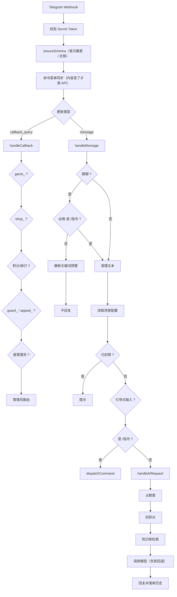

# 🏗️ 架构与数据库

[返回首页](../README.md) · [文档索引](README.md)

## 为什么是 Workers + D1 + Workers AI

- **零运维**：没有服务器、没有容器、没有常驻进程；定时任务由平台的 Cron Trigger 触发
- **数据自持**：用户、积分、知识库、审计全部落在自己账号的 D1 里
- **成本可控**：个人 / 小群规模基本在免费额度内
- **代价**：没有本地磁盘，CPU 时间与内存有限——所以 AI 上下文、知识库块数、群发批量都设了明确上限

## 请求处理流程



### 消息链路的判断顺序（很重要）

`src/handlers/message.js` 里各段判断是有先后依赖的：

1. 管理员上传知识库文件（`.txt` / `.docx` / `.pdf`）——放最前面，带说明文字的文档也要能入库
2. 群聊过滤：不是 @机器人 也不是 `/指令` 的消息只做**静默预警**后返回
3. 封禁校验（管理员不受限）
4. 各类引导式输入（商品、任务、知识库、群规）——必须排在指令分发之前，否则用户正在填的表单会被当成未知指令丢掉
5. 指令分发（注册表统一处理权限 / 仅私聊 / 仅群聊 / 功能开关）
6. 落到 AI 对话

处置、举报、申诉**没有自然语言入口**：`封禁 / 拉黑 / 踢了` 这类词在日常聊天里太常见，
靠关键词拦截会误伤普通发言，所以只认 `/指令`（这是刻意的取舍，改动前先想清楚）。

回调（`src/handlers/callback.js`）同理：**前缀更长的分支必须排在更短的前面**，且群规确认与申诉卡片要放在「管理员校验」之前——因为群管理员也需要点确认。

## 目录结构

```
src/
├── index.js                 # Worker 入口：安全校验 → 建表 → 分发 / 定时任务
├── config/                  # 常量（积分、回调前缀、知识库参数）· 用户文案 · 任务触发器
├── core/                    # context.js（userKey/sceneKey）· db.js（Schema + 迁移）· logger.js
├── telegram/                # api.js（含 429/5xx 退避重试）· auto-delete.js（群聊自动删除，按类型取时长）
├── handlers/
│   ├── message.js           # 消息总入口
│   ├── callback.js          # 按钮回调总入口（路由顺序即优先级）
│   ├── ai.js                # AI 对话：额度 → 扣分 → 知识库检索 → 模型回退 → 历史
│   └── commands/            # registry.js（命令注册表）+ 各指令 + commands/admin/
├── admin/                   # 管理面板：用户/群组/封禁/详情/积分/限额/频率/知识库/群规/自动删除/日志/统计
├── services/                # 业务服务
│   ├── users.js · points.js · quota.js · time.js · checkin.js · admin-log.js
│   ├── admins.js            # 管理员与角色（owner / admin / moderator + 能力判定）
│   ├── config.js            # 统一配置模型：作用域链 → 生效值 + 来源
│   ├── cache.js             # isolate 级 TTL 缓存（按数据库实例隔离）
│   ├── alerts.js            # 异常私聊告警（同类 5 分钟去重）
│   ├── ai-tools.js          # AI 只读工具（积分 / 签到 / 排行 / 群规 / 知识库）
│   ├── lottery.js           # 抽奖：每日免费 + 花积分抽
│   ├── features.js          # 三级功能开关
│   ├── auto-delete.js       # 消息自动删除设置（按类型两级配置）
│   ├── settings.js          # 全局键值设置
│   ├── knowledge.js         # 知识库：切块、向量、检索、索引重建
│   ├── guard.js             # 群规执法：意图解析、理由校验、Telegram 群处置、审计
│   ├── command-menu.js      # 输入框命令菜单（由注册表生成 + 哈希版本同步）
│   ├── text-extract.js      # 文档正文抽取（txt / docx / pdf）
│   ├── history.js           # AI 上下文裁剪
│   └── daily.js             # 定时任务：清理、日报、索引维护、到期通知
├── games/                   # 游戏注册表 + 4 个游戏
├── shop/                    # 商城：用户侧 / 管理侧 / 添加 / 编辑 / 订单动作 / 备注 / 通知
└── utils/                   # html.js（转义）· random.js（加密随机）· layout.js（菜单排版与分页）

test/                        # 测试用例（node:test）
test-helpers/d1.mjs          # 用 node:sqlite 跑真实 SQL 的 D1 替身
scripts/                     # check.mjs（自检）· backup.mjs（导出）· backup-config.mjs（配置备份）
docs/                        # 本目录
```

## 数据隔离：userKey 与 sceneKey

| 键 | 形式 | 管什么 |
|----|------|--------|
| `userKey` | `user:<用户ID>` | **全局积分**、封禁状态——跨私聊与所有群共享 |
| `sceneKey` | `private:<用户ID>` | 私聊场景：每日额度、冷却、AI 记忆、功能开关覆盖 |
| `sceneKey` | `group:<群ID>:user:<用户ID>` | 群内成员场景：同上，互不影响 |
| 群级键 | `group:<群ID>` | 群知识库、群规与执法配置（整群共享，不绑定某个成员） |

## 关键设计约定

| 主题 | 约定 |
|------|------|
| 积分安全 | 扣分用 `UPDATE ... WHERE points >= ?` 原子条件更新；加分写 `points_log` 流水；失败补偿回滚 |
| 数据库迁移 | `SCHEMA_VERSION` + `schema.version` 标记；建表全部 `IF NOT EXISTS`；迁移逐条幂等执行并忽略「字段已存在」 |
| 引导式输入 | 所有会话（商品 / 任务 / 知识库 / 群规 / 下单备注）30 分钟过期，定时任务兜底清理——避免残留会话吞掉用户消息 |
| 菜单排版 | 统一走 `src/utils/layout.js`：单行 ≤ 2 个按钮、整菜单 ≤ 8 行、按钮文案 ≤ 32 字、`callback_data` ≤ 64 字节；`test/layout.test.mjs` 全量校验 |
| 加命令 | 只在 `src/handlers/commands/registry.js` 的 `COMMANDS` 加一条；权限、仅私聊、功能开关、`/help`、输入框菜单全部自动生效 |
| 加功能开关 | 只在 `src/services/features.js` 的 `FEATURES` 加一项；三级开关 UI 自动出现 |
| 随机数 | 统一用 `src/utils/random.js`（`crypto.getRandomValues`），不用 `Math.random` |
| HTML 消息 | 用户可控文本进 HTML 前必须 `escapeHtml()`（包括 usage 占位符） |

## 数据库

全部由 `src/core/db.js` 在首次请求时自动创建（当前 `SCHEMA_VERSION = 12`，共 29 张表）。

| 分组 | 表 | 说明 |
|------|-----|------|
| 用户与场景 | `users` | 全局用户：积分、封禁状态 |
| | `user_scenes` | 场景配置：语言、自定义 prompt、每日额度、冷却、最后发言时间 |
| | `chat_history` | 每个场景的 AI 对话记忆（JSON） |
| 积分与签到 | `points_log` | 积分流水：变动值、变动后余额、原因、时间 |
| | `daily_stats` | 每场景每天的消息计数（额度控制） |
| | `daily_checkin` | 签到记录（用户 + 日期） |
| | `lottery_draws` | 抽奖记录（免费那次靠部分唯一索引保证每天一次） |
| 权限 | `bot_admins` | 额外授权的管理员（角色 / 备注 / 授权人）；拥有者由环境变量决定 |
| | `admin_manage_sessions` | 添加管理员的引导式输入状态（30 分钟过期） |
| 商城 | `shop_items` | 商品：价格、库存、分类、限购、上下架 |
| | `shop_orders` | 订单：订单号、用户、商品与价格快照、状态、备注 |
| | `shop_order_log` | 订单操作日志 |
| | `shop_add_sessions` / `shop_edit_sessions` / `shop_order_drafts` | 商品添加 / 编辑 / 下单备注引导状态 |
| 兑换码 | `redeem_codes` | 面额、次数上限、已用次数、过期日、启停 |
| | `redeem_logs` | 兑换记录（`UNIQUE(code_id, user_key)` 保证每人一次） |
| 知识库 | `kb_docs` | 文档：作用域、标题、来源、正文、分块数、启停 |
| | `kb_chunks` | 分块：正文 + 向量（base64 Float32Array）+ 生成向量的模型名 |
| | `kb_sessions` | 知识库引导状态 |
| 群规执法 | `group_guard` | 每群配置：群规正文、默认处置、默认禁言时长、预警开关与关键词 |
| | `group_punishments` | 处置记录与审计：对象、动作、理由、依据、时长、到期时间、操作人、状态 |
| | `punishment_appeals` | 申诉：申诉人、理由、状态、处理人 |
| | `group_rule_versions` | 群规版本历史（支持回滚） |
| | `guard_sessions` | 群规编辑引导状态 |
| 系统 | `admin_sessions` | 管理员解锁会话（30 分钟） |
| | `admin_logs` | 管理员操作审计 |
| | `broadcast_drafts` | 群发草稿与进度游标（支持断点续发） |
| | `scene_settings` | 键值设置：功能开关、任务设置、Schema 版本、命令菜单版本 |

### 关于迁移

新增字段 / 表时按这个顺序改：

1. `SCHEMA_SQL` 里加表或索引（`CREATE ... IF NOT EXISTS`）
2. 结构或数据迁移写进 `MIGRATIONS` 数组（必须幂等）
3. `SCHEMA_VERSION` +1（冷启动靠它跳过建表）
4. 需要一次性灌数据时用标记（如 `task.seeded`），避免管理员删掉的数据又被灌回来

冷启动逻辑：先读 `schema.version`，已是最新就只花一次查询；落后才建表 + 跑迁移 + 写回版本号。

> 用别的数据库也可以，`SCHEMA_SQL` 里的语句是标准 SQL（全部幂等）；但 Workers 侧推荐 D1——同账号、免连接串、绑定即成。
